<div align="center">

# Amharic Bible Companion - Your Premium Spiritual Journey


**Amharic Bible Companion** is a beautifully designed mobile application built with Flutter. It's your premium, all-in-one companion for studying the Bible in Amharic, tracking your spiritual progress, and staying inspired through a modern, elegant interface.

[](https://flutter.dev)
[](https://opensource.org/licenses/MIT)
[]()

</div>

---

### ✨ Features

#### 📖 Core Bible Experience
- **Full Amharic Bible**: Complete access to both Old and New Testaments.
- **Seamless Reading**: Optimized reading interface with customizable font sizes.
- **Deep Onyx Theme**: A premium dark-gold aesthetic for a refined, glare-free reading experience.

#### 📝 Spiritual Tools
- **Spiritual Journal**: A dedicated space to record your prayers, insights, and spiritual reflections.
- **Daily Verse**: Stay inspired with a hand-picked verse of the day on your home screen.
- **Reading Plans**: Track your progress as you dive deeper into the Word.

#### ⚙️ Advanced Functionality
- **Smart Search**: Quickly find any book or verse with real-time indexing.
- **Bookmarks**: Save and manage your favorite verses for quick access.
- **Daily Reminders**: Set custom notifications to encourage consistent daily reading.

---

### 📸 Screenshots

#### 🌟 Experience & Navigation
| Onboarding | Home Screen | Book Selection |
| :---: | :---: | :---: |
| 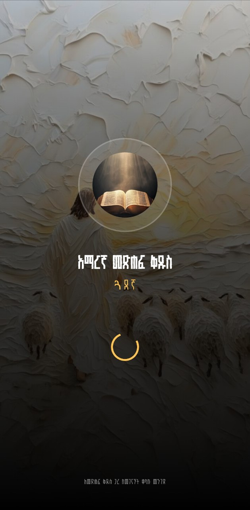 | 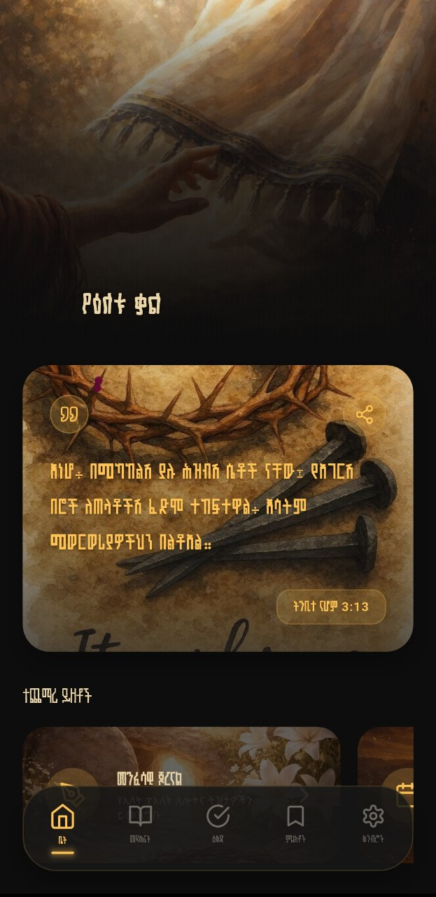 | 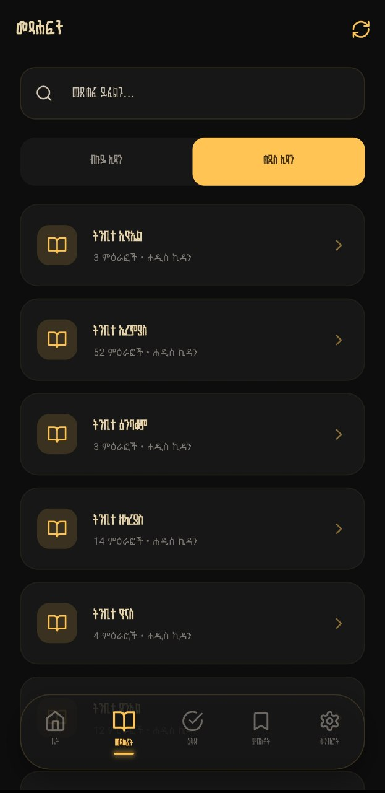 |

#### 📖 Reading & Content
| Chapter List | Reading Mode | Daily Plan |
| :---: | :---: | :---: |
| 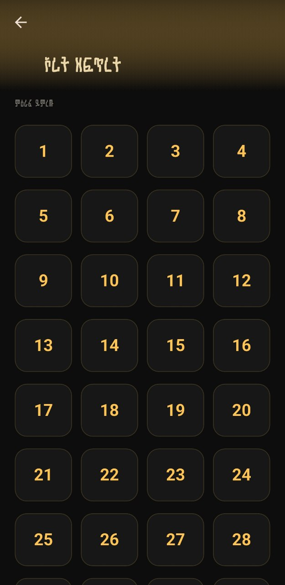 | 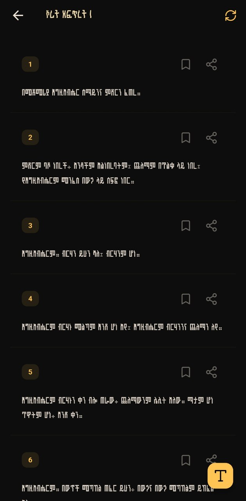 | 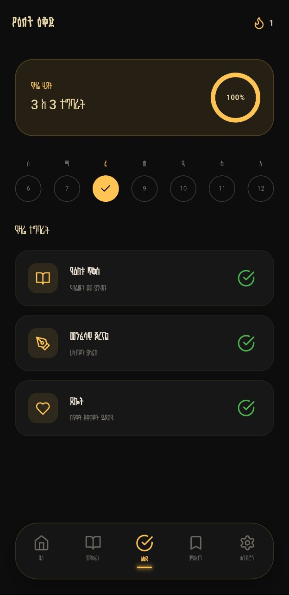 |

#### 📝 Journal & Productivity
| New Journal | Saved Journals | Reminders |
| :---: | :---: | :---: |
| 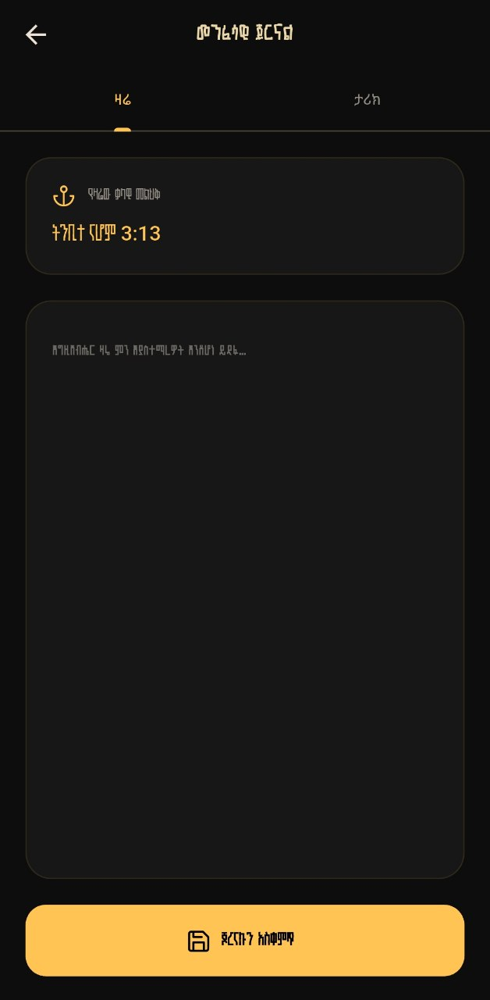 | 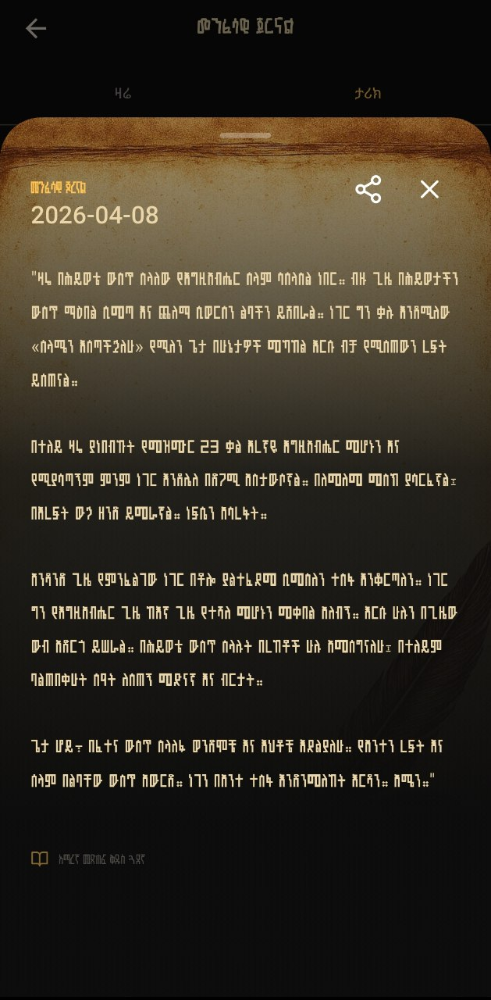 | 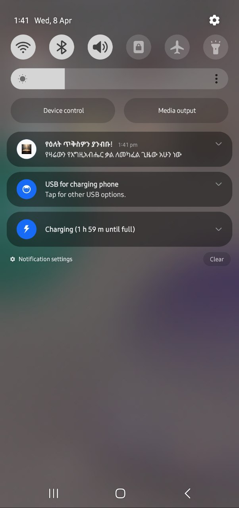 |

#### ⚙️ Customization
| Settings | Time Picker (Analog) | Time Picker (Keyboard) |
| :---: | :---: | :---: |
| 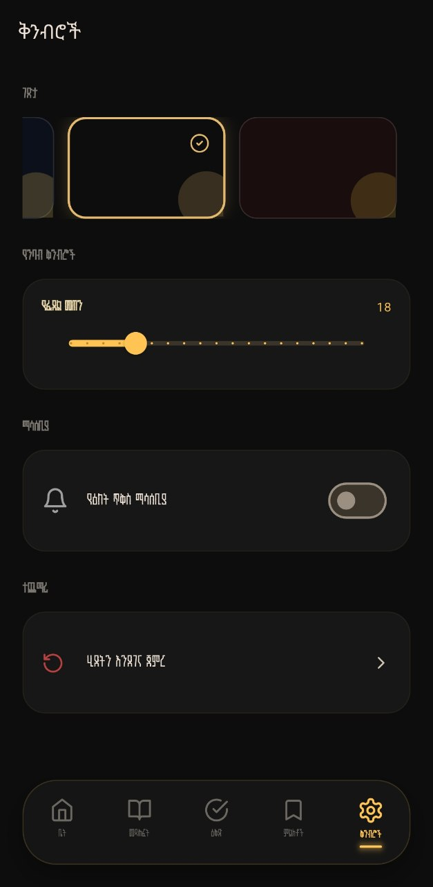 | 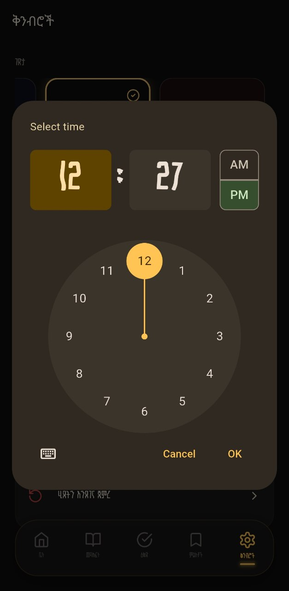 | 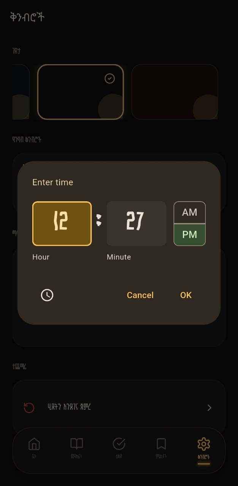 |

---

### 🚀 Getting Started

#### Prerequisites
- Flutter SDK (Latest Stable)
- Android Studio / VS Code
- Android/iOS Device or Emulator

#### Installation
1. Clone the repository:
   ```bash
   git clone https://github.com/belkysupreme22/amharic-bible.git
   ```
2. Navigate to the project directory:
   ```bash
   cd amharic_bible_companion
   ```
3. Install dependencies:
   ```bash
   flutter pub get
   ```
4. Run the application:
   ```bash
   flutter run
   ```

---

### 🛠 Tech Stack
- **Framework**: [Flutter](https://flutter.dev)
- **Language**: [Dart](https://dart.dev)
- **State Management**: [Provider](https://pub.dev/packages/provider)
- **Database**: [Shared Preferences](https://pub.dev/packages/shared_preferences)
- **Icons**: [Lucide Icons](https://pub.dev/packages/lucide_icons)
- **Typography**: [Google Fonts](https://pub.dev/packages/google_fonts) & Custom Fonts:
  - **Loga**: Main UI headers.
  - **BelaHidase**: Artistic titles.
  - **Selam**: Clean body text and verses.

---

### 📄 License
This project is licensed under the MIT License - see the [LICENSE](LICENSE) file for details.

---

<div align="center">
Made with ❤️ for the Amharic Speaking Community
</div>
